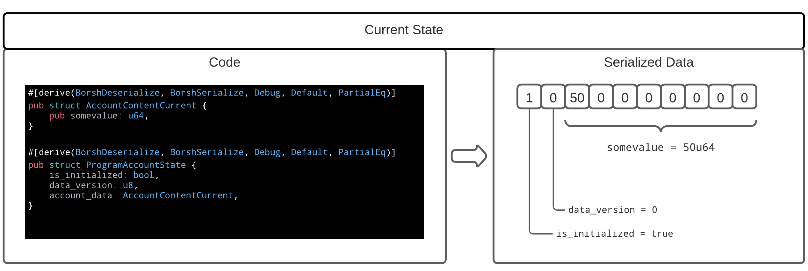

## versioning-solana

This repo demonstrates ONE rudimentary way to upgrade/migrate account data changes with solana program changes.

## What is data versioning?
Fundamentally to version data means to create a unique reference for a collection of data. This reference can take the form of a query, an **ID**, or also commonly a datetime identifier.

### Simple scenario:
1. You create a program that stores a `u64` value in your program's accounts data, assume you initialized the account and set `somevalue` to `50u64`

2. Later on you decide that you want to also have some `String` value to reside in the account data that the rest of your program requires to be present

What do you do? There are a few options:

1. If the initial allocation of your program account has room to spare, and you had the foresite to include a 'data version' indicator in the account data: This repo will demonstrate an approach

2. If the initial allocation was sized specifically to the `u64`:

    * If you are running with a Solana version that incorporates the 'account re-allocation feature' (v 1.10.?) then leverage that
    * Otherwise, leveraging PDAs may help but someone else can demonstrate that

### On with the show
 In your initial planning, make sure to include a 'data version' field in your data. It can be a simple incrementing ordinal (e.g. u8) or something more sophisticated, up to you.

 When creating the Program account, allocate enough space for data growth

### Demonstration

#### First Version (`data_version` = 0)

1. Clone this repo
2. Change to repo folder
3. `git checkout v0.0.1`
4. Change to `program` folder
5. `cargo build-bpf`
6. Change back to repo folder
7. `code .`
8. Open the `prechange.rs` file in the main `test` folder
9. Click `Run Test` on `fn test_load_pass()`
10. Exit code
11. `mkdir stored`
12. Open another terminal and change to this repo folder then
13. `solana-test-validator -l ./.ledger`
14. From the first folder terminal:
    * `solana account -o stored/user1.json --output json-compact keys/accounts/user1_account.json`
    * `solana account -o stored/user2.json --output json-compact keys/accounts/user2_account.json`
15. In the terminal running `solana-test-validator` hit Ctrl+C to kill it

This will create two accounts with `somevalue` to 1 and then modify user account #1's value to `50u64`

#### First Version (`data_version` = 1)
1. From repo main folder run `cargo clean`
2. `git checkout main`
3. Change to `program folder`
4. `cargo build-bpf`
5. Change back to repo folder
6. `code .`
7. Open the `postchange.rs` file in the main `test` folder
8. Click `Run Test` on `fn test_post_data_change_u2_pass()`
